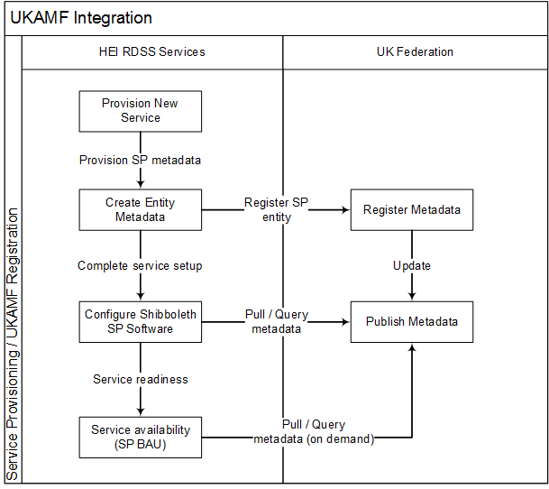

# UKAMF Integration - Provisioning

## Introduction

[UK federation] [1] operated by JISC is an access management federation for education and research. The federation primarily uses Shibboleth, which is standards based, open source software package for web single sign-on across organisational or institutional boundaries.

There are two types of entities in UK federation:
* Service provider (SP) entities
* Identity Provider (IdP) entities

Entities define roles that organisations play in the federation. An organisation can register multiple and different types of entities in a federation. To participate in UK federation, i.e. to access and share online resources, Organisations must join the UK federation, i.e.
 - apply for membership
 - undergo a verification process to validate their legal status and contact details
 - register their services as entities – procedures exist for the different types of entities.

RDSS is already a member of UK federation as RDSS is part of JISC. The only process applicable for RDSS is SP entities registration and shibolleth setup, i.e.
 1. Service provider entities registration and required metadata published through UK federation
 2. RDSS setups the latest Shibboleth SP software and configures the software. The software is also updated using the metadata published by UK federation. The metadata can be downloaded on demand through Metadata queries (MDQ).
 3. RDSS tests software configuration.
 4. Refreshing of metadata published by UK federation as business as usual.

## Scope
This document specifies the requirements for provisioning a service that is to be integrated to UKAMF. This document is for RDSS vendors.

### Versioning

Current version:&nbsp;&nbsp;&nbsp;&nbsp;`0.0.1-SNAPSHOT`

Versioning for the RDSS SP Metadata template follows [Semantic Versioning 2.0.0](http://semver.org/spec/v2.0.0.html).

### Comformance

The keywords **MAY**, **MUST**, **MUST NOT**, **NOT RECOMMENDED**, **RECOMMENDED**, **SHOULD** and **SHOULD NOT** are to be interpreted as described in [RFC2219](https://tools.ietf.org/html/rfc2119).

## Service Metadata
The metadata published by the UK federation uses the SAML 2.0 metadata format. The metadata for a service provider entity contains the following required elements:

- **EntityDescriptor** – this defines an entity ID that uniquely identifies an entity in a federation.
- **Extensions** – This defines the SAML extensions and contains relevant digest and signing methods that is in use by the service provider. The extensions provide service consumers with relevant information required when interacting with the service provider. All services exposed under RDSS will expose the same extensions. Service exceptions will be discussed on a case by case basis at the program level.
- **SPSSODescriptor** – This includes the following key elements:
  - **UIInfo** – This contains the UI information element that helps with user experience. This information includes user friendly service name, description and service logo that is displayed to a user. An identity provider or central discovery service could display this information to a user so to provide assurances to a user that they accessing the right service. Although this is an optional element, we recommend it as a requirement for RDSS SP.
  - **X509Certificate** – Certificates used for signing and encrypting information when interacting with the service provider. One or more certificates could be provided for this interaction.
  - **ArtifactResolutionService** – defines the endpoint of a SOAP service for resolving SAML 2.0 artefacts
  - **SingleLogoutService** – This element defines the endpoints for supporting single logout. If a service does not support single logout, these elements should be left out.
  - **ManageNameIDService** – is optional and should be used if the RDSS service supports name identifier changes or terminations.
  - **AssertionConsumerService** – this defines the endpoints that an IdP sends user’s information to at the SP. It defines the authorised endpoints used by a SP. The bindings attribute defines how to interact or communicate with an endpoint. RDSS SP will support the six commonly used bindings.

SP metadata RDSS template is in [rdsss-metadata.xml](template/rdss_metadata.xml).

## UK Federation Registration
RDSS will be registered as service providers’ entities in UK federation. The registration will be based on the latest version of the Shibboleth SP software (open source).



### Data required

Key | Description / Notes | Ownership | Example
-- | -- | -- | --
ENTITY_ID | An absolute URI for uniquely identifying the service. The host part of the URI used for RDSS SP must be JISC domain, i.e. `jisc.ac.uk`. <p>In accordance to [Entity ID Policy document][6], URI should have the following parts: <ul><li>Scheme – this must be https </li><li>Servicename concatenated to rdss to indicate it is a RDSS service. </li><li>host – this must be Jisc domain </li><li>sp – to indicate it is a service provider </li><li>shibboleth – tool in use </li></ul></p> | Jisc | `https://servicename-rdss.sp.jisc.ac.uk/shibboleth`
X509_CERTIFICATE | X509 certificates in use by the service | Jisc | Too long to be included in this table
SERVICE_NAME | The name of the RDSS service | Jisc |
SERVICE_DESCRIPTION | A short description of the RDSS service | Jisc |
SERVICE_LOGO_URL | A URL for the service logo | Vendor | `https://servicename.inst.rdss. jisc.ac.uk/servicelogo.png`
SERVICE_ORG_NAME | The organisation that the service belongs to | Jisc | `JISC`
SERVICE_ORG_DISPLAY_NAME | The display name for an organisation | Jisc | `JISC RDSS`
ORGANISATION_URL | The URL for the organisation | Jisc | `https://jisc.ac.uk/`
SERVICE_CONTACT_SUPPORT_NAME | Support contact name for the service | Jisc | RDSS Support
SERVICE_CONTACT_SUPPORT_EMAIL | Support contact email address for the service | Jisc | rdss@jisc.ac.uk
SERVICE_CONTACT_TECH_NAME | Technical contact name for the service | Jisc | RDSS Tech
SERVICE_CONTACT_TECH_EMAIL | Technical contact email address for the service | Jisc | rdss.tech@jisc.ac.uk

### Registration Process

#### Manual process
Currently, entity registration is a manual process. After an organisation as applied for membership and underwent legal validation. An Organisation that is a UK Federation member sends electronically, e.g. email, to UKAMF to register one or more entities, e.g. a SP entity. When an entity has been confirmed and the required metadata validated, UKAMF confirms and publishes the entity in the [UK federation metadata][3]. Other entities in the federation can now access or interact with the new entity.

#### API Process
The existing manual process is not a feasible or scalable option for RDSS. It is understood an [API][2] is under development that can expose the required steps and automate the process of entity verification and publication.

The API under development supports the following:
 1. Add / update / Delete Entity descriptor – i.e. for submitting/managing SAML Metadata entities
 2. Workflow for submitting entity descriptors that require approval. The API posts the submitted entity descriptor to the Approvals API. When an approval has been secured, the Organisation is notified and the entity descriptor is resubmitted.
 3. HTTP Basis authentication, i.e. username and password, for authenticating a user that is representing an organisation. (It is not yet clear how/when UKAMF gets and stores the information required for validating/authenticating a user).

Note: A POC to be performed to trial the API and confirm any additional information that may be required.

## Identity Provider Definition
At least one IDP must be defined for a RDSS SP and configured on the Shibboleth 2 software. The entity ID for an IdP must match the entityId defined and published in [UK federation metdata.xml][3].

The following are required for configuring Shibboleth 2 software for a SP entity.

 - A copy of [UK federation metadata] [3] signing certificate, i.e. [ukfederation.pem] [4], should be downloaded. The fingerprint of the certificate must be validated by speaking to [UK Federation helpdesk][5].
 ```sh
    openssl x509 -sha1 -fingerprint -noout -in ukfederation.pem
 ```

 - Following SP entity metadata registration, shibboleth v2 configuration (shibboleth2.xml) requires the following updates:

Key  | Element ? AttrName | Description / Notes  | Example
---|---|---|---
ENTITY_ID  | ApplicationDefaults ? entityId | The Hostname of the service. This must match hostname of the SP entityID defined in the submitted entity  metadata | `<ApplicationDefaults entityId="https://servicename-rdss.sp.jisc.ac.uk/shibboleth" ...>`
ENTITY_ID (IdP)  | SSO ? entityID  | This must correspond to the entityID of an IdP defined in the UK federation metadata xml.  | `<SSO entityID="https://idp.uni.ac.uk/idp/shibboleth"> SAML2 SAML1 </SSO>`
CDS_URL  | SSO ? discoveryURL  | This should only be defined for services that supports users from many IdPs.  | `<SSO discoveryProtocol="SAMLDS" discoveryURL="https://wayf.ukfederation.org.uk/DS"> SAML2 SAML1 </SSO>`
MDQ_SUBST  | Subst  | UK Federation MDQ server endpoint and substitute string  | `<Subst>http://mdq.ukfederation.org.uk/entities/$entitiyID</Subst>`
UKAMF_CERT | MetadataProvider ? certificate  | The downloaded and validated UK federation certificate for validating UK federation metadata  | `<MetadataFilter type="Signature" certificate="ukfederation.pem"/>`


 - Shibboleth software must be configured to use metadata query protocol for querying on demand an IdP metadata. This is achieved by defining the below in the shibboleth2.xml file:

   ```xml
   <MetadataProvider type="Dynamic" ignoreTransport="true">               
      <Subst>http://mdq.ukfederation.org.uk/entities/$entityID</Subst>
      <MetadataFilter type="RequireValidUntil" maxValidityInterval="1209600"/>
      <MetadataFilter type="Signature" certificate="ukfederation-mdq.pem"/>
   </MetadataProvider>
   ```

## Central Discovery Service
If a service is meant to serve users from different identity providers, the SP must be configured to use the central discovery service.

Although, the central discovery service (CDS) supports two discovery protocols, i.e. “WAYF protocol” and “DS protocol”, RDSS SPs that require CDS support will be configured using the DS protocol based CDS, i.e. https://wayf.ukfederation.org.uk/DS.

## User Logout from a UKAMF Integrated Service
When a user logs-out from a service that has been integrated to UKAMF, the following must occur:
1. The user session on a service (e.g. user session on Archivematica or Semvera services),  must be removed, i.e. corresponding session cookies on a user's browser must be invalidated/deleted and the user session on the server-side but be terminated/invalidated.
2. When a user logs-out from a service, the following must occur:
  - The user must be redirected to a new page. The redirected page must display a message similar to this: "You are now logged out from {SERVICE_NAME}, we recommend you close your browser if your are on a shared desktop or device".
  - A user should not be able to use the browser back button to view protected or sensitive content pages, without reauthentication. This can be achieved by disabling browser cache on all protected or sensitive pages, e.g. *`"Cache-Control: no-cache"`*. It is acknowledged that this may have performance implications for authenticated users that uses their browser back button often.

Users are advised to close their browsers when they have finished using a service or are not using other services that are protected by UKAMF (Shibboleth) on a device. This is to ensure other users or malicious users could not assume or hijack the identity of a UKAMF user on a device.

[//]: # (Reference links used in the body of this)

[1]: <https://github.com/joemccann/dillinger>
[2]: <https://api.dev.ja.net/api.html#>
[3]: <http://metadata.ukfederation.org.uk/ukfederation-metadata.xml>
[4]: <http://mdq.ukfederation.org.uk/ukfederation-mdq.pem>
[5]: <https://www.ukfederation.org.uk/content/Documents/UKFederationHelpdesk>
[6]: <https://www.ukfederation.org.uk/content/Documents/EntityIDPolicy>
